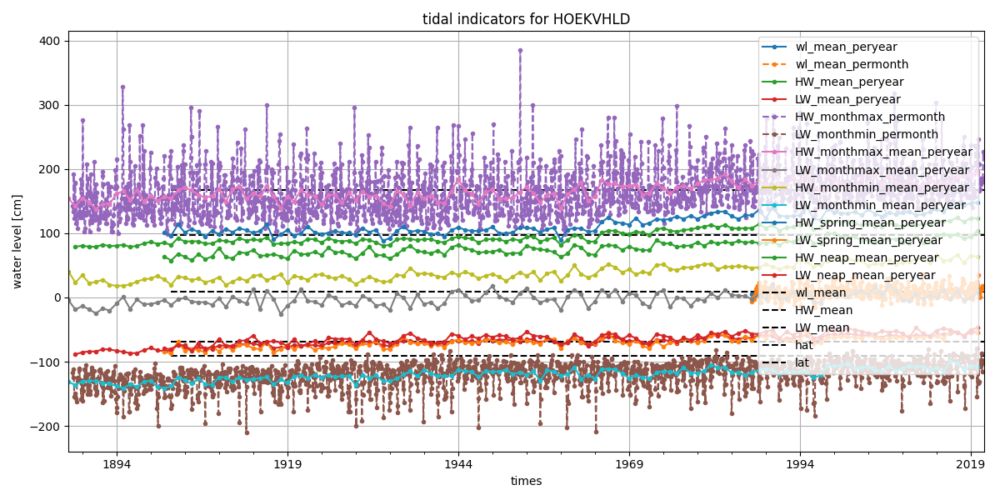
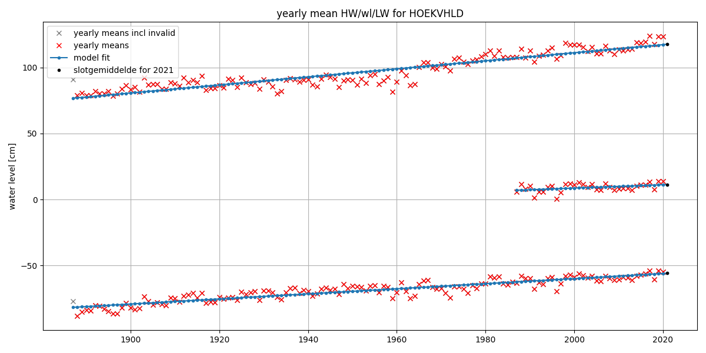
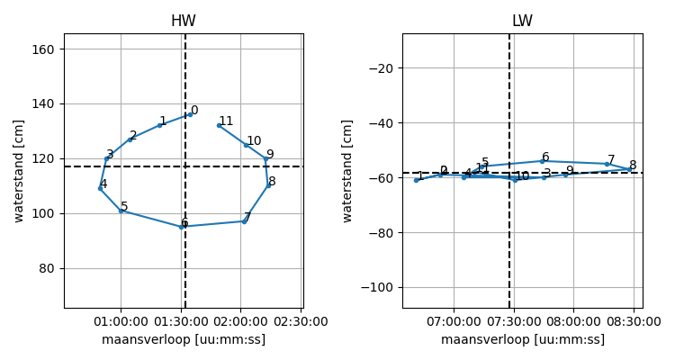
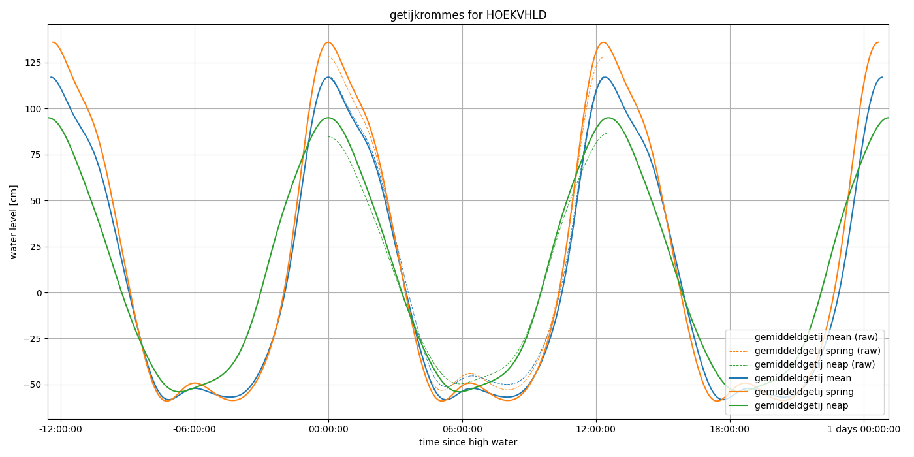
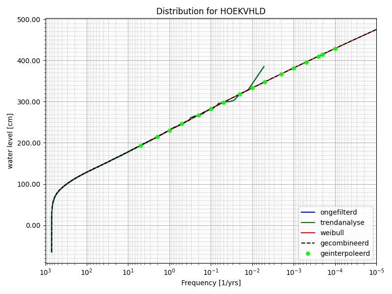
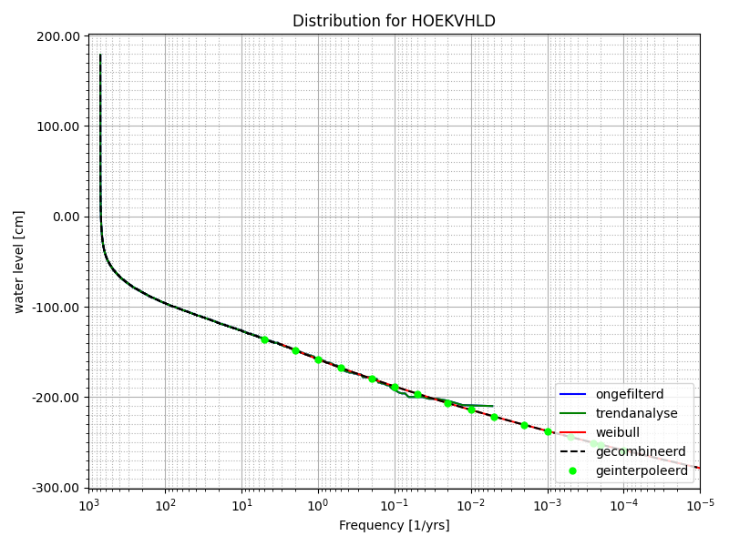

# Example

**Let op: de figuren op deze pagina zijn gegenereerd op basis van voorlopige en onvolledige waterstandsdata en tevens voorlopige methodieken. De figuren bevatten dus geen officiele resultaten, maar dienen slechts ter illustratie.**

Deze pagina geeft een voorbeeld van de Kenmerkende Waarden voor Hoek van Holland. De tekst is gebaseerd op Deltares memo 11205232-007-ZKS-0003 en waar nodig bijgewerkt.

## Metingen

De waterstandsmetingen (gemeten tijdreeksen en extremen) worden geautomatiseerd opgehaald van de DataDistributieLaag van Rijkswaterstaat. Hiervoor wordt [ddlpy](https://github.com/Deltares/ddlpy) gebruikt. Als er aggers aanwezig zijn in de tijdreeksen van extremen, worden deze eerst geconverteerd tot een reeks met alleen dominante hoog- en laagwaters. De data wordt opgehaald met de functie [retrieve_measurements()](https://deltares-research.github.io/kenmerkendewaarden/modules.html#kenmerkendewaarden.data_retrieve.retrieve_measurements).

## Getij indicatoren

Verschillende getij-indicatoren kunnen worden afgeleid van tijdreeksen en extremen van waterstanden. Dit zijn bijvoorbeeld HAT en LAT, maar ook indicatoren als GHW (HW_mean), GLW (LW_mean), GHHW/GHWS (HW_monthmax_permonth) en GLLW/GLWS (LW_monthmin_permonth). De getijindicatoren worden afgeleid met de functies [calc_wltidalindicators()](https://deltares-research.github.io/kenmerkendewaarden/modules.html#kenmerkendewaarden.tidalindicators.calc_wltidalindicators) en [calc_HWLWtidalindicators()](https://deltares-research.github.io/kenmerkendewaarden/modules.html#kenmerkendewaarden.tidalindicators.calc_HWLWtidalindicators)

## Slotgemiddelden

De slotgemiddelden worden bepaald door een lineare trend te fitten door de jaargemiddelde waterstanden, hoogwaters en laagwaters. Deze trend wordt doorgetrokken tot 1 januari 2021 om zo het slotgemiddelde 2021.0 te bepalen. Indien nodig wordt een breekpuntjaar toegepast, waarbij alleen alle data na dat punt wordt meegenomen. Verder worden alleen de jaren met voldoende dekking meegenomen in de lineaire trend. De slotgemiddelden worden berekend met de functie [calc_slotgemiddelden()](https://deltares-research.github.io/kenmerkendewaarden/modules.html#kenmerkendewaarden.slotgemiddelden.calc_slotgemiddelden).

Vroegere methodieken waren complexer, maar deze methode is robuuster en minder gevoelig voor de hoeveelheid beschikbare data. Binnen de Zeespiegelmonitor wordt een wel een veel exactere methodiek toegepast om nauwkeurig de zeespiegelstijging te kunnen berekenen, maar dit ligt buiten de scope van de Kenmerkende Waarden.

In de onderstaande figuur zijn de slotgemiddelden 2021.0 weergegeven met zwarte puntjes.

## Havengetallen

De havengetallen en de resulterende aardappelgrafiek worden bepaald door de relatie af te leiden tussen de maansculminaties en het tijdstip+hoogte van ieder hoog- en laagwater. Een maansculminatie is de doorgang van de maan door de plaatselijke meridiaan, de maan staat op dat moment dus op zijn hoogst vanaf de locatie op aarde waar vandaan geredeneerd wordt. De relatie tussen de maansculminatie en het tijdstip van het hoog- en laagwater wordt gebruikt om de relatie tussen de aarde, maan en de zon af te leiden. Het tijdstip van de dag is een indicatie van de stand van de zon ten opzichte van de nulmeridiaan van de aarde. Als de maan om middernacht of op het middaguur culmineert, betekent dit dat de zon, aarde en maan op één lijn staan. In beide gevallen is het springtij. Als de maan om zes uur ’s ochtends of ’s avonds culmineert, staan de aarde, maan en zon in een hoek van 90 graden met elkaar. Dit resulteert in doodtij.

Na het berekenen van de maansculminaties met de [astrog module in hatyan](https://deltares.github.io/hatyan/modules.html#hatyan.astrog.astrog_culminations), wordt voor het beschouwde decennium ieder hoogwater en het erop volgende laagwater gerelateerd aan de relevante maansculminatie. Dit is de boven/onder maansculminatie die ongeveer twee dagen eerder plaatsvindt en op dat moment een getijgolf in de Zuidelijke IJszee opwekt, welke ongeveer twee dagen later aan de Nederlandse kust wordt waargenomen. Om precies te zijn wordt voor iedere culminatie een bijbehorend hoogwater gezocht in de periode die daar minstens 2 dagen, 2 uur en 20 minuten op volgt:
- plus 48 uur en 100 minuten (vier getijperiodes van 12 uur en 25 minuten, want ieder hoogwater is het gevolg van een het getij dat twee dagen ervoor op de Zuidelijke IJszee werd opgewekt)
- minus 20 minuten (correctie van de 0 graden meridiaan naar de 5 graden meridiaan, ongeveer de locatie van Nederland)
- plus 1 uur (correctie van GMT naar MET, dit gebeurt automatisch doordat de tijdzones correct zijn geregistreerd voor alle data)

Doordat het hoogwater op deze manier bij de culminatie wordt gezocht, is er later geen correctie meer nodig op de tijdsas van de aardappelgrafiek.

Deze hoog- en laagwaters worden vervolgens opgedeeld in klassen van uren, corresponderend met het uur van de dag waarin ze optreden. De uren worden afgerond, zodat uurklasse 9 de tijden van 8:30 tot 9:30 bevat (en tevens van 20:30 tot 21:30). Binnen alle 12 klassen wordt de mediaan van de waterstanden en de mediaan van het aantal uur na de maansculminatie als representatief beschouwd voor de betreffende klasse. Deze worden uitgezet in de onderstaande aardappelgrafiek. De havengetallen worden berekend met de functie [calc_havengetallen()](https://deltares-research.github.io/kenmerkendewaarden/modules.html#kenmerkendewaarden.havengetallen.calc_havengetallen).

Door de methodiek van het berekenen van de havengetallen te doorlopen, zijn de volgende waardes te berekenen:
- De hoogtes van hoog- en laagwaters voor 12 culminatieklassen.
- De vertraging van hoog- en laagwaters ten opzichte van de maansculminatie voor 12 culminatieklassen.
- De gemiddelde getijduur voor 12 culminatieklassen
- De duur van de daling voor 12 culminatieklassen

Vanuit de 12 culminatieklassen kunnen de waardes voor springtij (klasse/uur 0), doodtij (klasse/uur 6) worden geselecteerd. De waarde voor gemiddeld tij is het gemiddelde van alle culminatieklasses.

## Gemiddelde getijkrommen

### Kromme voor gemiddeld tij

Voor het opstellen van de kromme voor gemiddeld getij is een harmonische getijanalyse op de waterstanden van de laatste 10 jaar toegepast met [hatyan](https://github.com/Deltares/hatyan). Deze analyse is uitgevoerd aan de hand van de standaardset van 94 getijdecomponenten.

Uit het resultaat van deze analyse zijn de zuivere harmonischen van M2 gekozen: M2, M4, M6, M8, M10, M12. Vervolgens is voor deze componenten de amplitude vervangen door de wortel van de kwadraatssom van de amplituden van alle componenten uit de betreffende band. Voor bijvoorbeeld M12 zijn dan de amplituden van M12 zelf en van 4MSN12, 5MS12, 4M2S12 gebruikt. De fases van de componenten zijn niet aangepast.

Met de resulterende zes componenten is een waterstandsvoorspelling uitgevoerd met hatyan. Dit levert een zichzelf repeterend getijdesignaal op, de ruwe kromme voor gemiddeld getij.

### Kromme voor spring- en doodtij
Het opstellen voor de gemiddelde getijkrommen voor spring- en doodtij gebeurt volgens een vergelijkbare methode als voor het gemiddelde getij. Hiertoe wordt eerst een harmonische getijanalyse uitgevoerd met hatyan. 
 
Uit het resultaat van de analyse zijn de componenten met uitsluitend zuivere combinaties van M2 en S2 geselecteerd. Dit zijn de componenten SM, 3MS2, μ2, M2, S2, 2SM2, 3MS4, M4, MS4, 4MS6, M6, 2MS6, M8, 3MS8, M10, 4MS10, M12 en 5MS12. Zonder verdere aanpassingen aan de amplituden en fases, is er met deze componenten een voorspelling met hatyan gedaan. Om te zorgen voor waardes die representatief zijn voor een gemiddelde helling van de maansbaan, zijn knoopfactoren bij deze predictie uitgeschakeld. Hieruit volgt een zichzelf repeterend spring- en doodtijsignaal.

De representatieve spring en doodtijkrommes zijn geselecteerd door de kromme met de grootste versus de kleinste getijslag te selecteren. Deze enkele getijkromme is een aantal keer herhaald om tot een tijdserie van de ruwe kromme voor spring- en doodtij te komen.

### Schaling met de slotgemiddelden

De laatste stap om te komen tot de daadwerkelijke gemiddelde getijkrommen voor gemiddeld tij, springtij en doodtij is het schalen van deze ruwe kromme naar de slotgemiddelden. De getijkromme is in zijn geheel geschaald naar de getijslag zoals die volgt uit de slotgemiddelden voor hoog- en laagwater (voor gemiddeld, spring en doodtij). met deze getijkromme zijn met hatyan de hoog- en laagwaters bepaald, waaruit behalve de hoogtes hiervan ook de duur daling en duur rijzing afgeleid kunnen worden. De gemiddelde getijkrommen worden berekend met de functie [calc_gemiddeldgetij()](https://deltares-research.github.io/kenmerkendewaarden/modules.html#kenmerkendewaarden.gemiddeldgetij.calc_gemiddeldgetij).

## Overschrijdingsfrequenties

Het afleiden van de over- en onderschrijdingsfrequenties is grotendeels gebaseerd op de HKV- rapportage van Van Veen (2006). Hierbij zijn enkele wijzigingen toegepast aan de methodiek, zodat de resultaten reproduceerbaar zijn en het aantal verborgen aannames is verminderd. In onderstaande methodiek wordt uitgegaan van de overschrijdingsfrequentielijn. Voor de onderschrijdingsfrequentielijn wordt dezelfde methodiek toegepast, maar dan met getijminima (ook wel laagwaters).

Bij het bepalen van de over- en onderschrijdingsfrequenties wordt de data eerst naar gemiddelde uurwaarden vertaald, zodat de meer recente 10-min meetdata dezelfde weging heeft als de oudere uurlijkse meetdata. Van deze uurwaarden worden vervolgens de getijmaxima (ook wel hoogwaters) bepaald waarmee verder wordt gerekend. Hierbij wordt verondersteld dat de getijmaxima onafhankelijk van elkaar zijn, een belangrijke aanname voor het bepalen van de overschrijdingsfrequenties.

Voor opstellen van de definitieve over- en onderschrijdingsfrequentielijn worden vier typen lijnen gebruikt:

- Ongefilterd
- Gefilterd
- Trendanalyse (gebaseerd op de gefilterde frequentielijn)
- Gefitte conditionele Weibull distributie
- Hydra-NL

De lijnen worden vervolgens gecombineerd. Vanuit deze resulterende lijn worden vervolgens de specifieke interessante frequenties voor in de tabellen geïnterpoleerd. De overschrijdingsfrequenties en onderschrijdingsfrequenties worden berekend met de functie [calc_overschrijding()](https://deltares-research.github.io/kenmerkendewaarden/modules.html#kenmerkendewaarden.overschrijding.calc_overschrijding).

